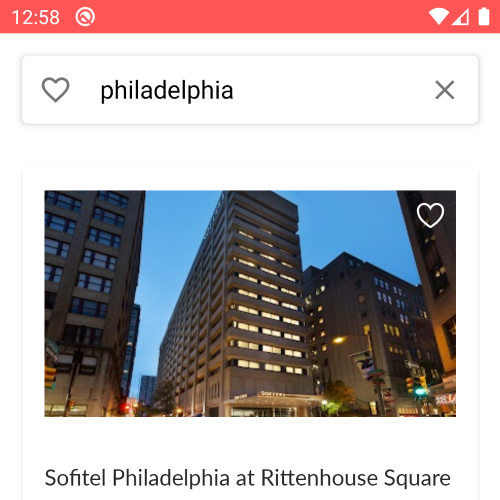


# MealsToGo

MealsToGo is a restaurant-finder built using the ReactNative CLI through the Zero to Mastery course on Udemy. Please see an Appetize.io hosted version of the app [here,](https://appetize.io/app/xcgyhuzkgfbqhjan708x2htw9m?device=pixel4&language=en&scale=75&orientation=portrait&osVersion=10.0) created from an apk generated by running ./gradlew assembleRelease in the android folder.

## Features
### Authentication
Meals To Go uses Firebase to handle user authentication. When the app loads, a splash screen displays, followed by a login / register screen. From here, users can login or sign up for a new account. If the user has previously logged in, this is kept track of locally and the user is redirected to their home screen.
### Restaurants
Restaurants are loaded from a call to the Google Places API, after making a call to the Google Geocoding API to get location data (latitude and longitude) for the search term. These calls are made via deployed Firebase functions.

### Restaurant Details
Each restaurant card is wrapped in a touchable opacity which navigates to a restaurant details screen using stack navigation. Information about the restaurant is passed as a param through navigation.navigate. Map markers on the map screen also navigate here.

### Map Screen
The map screen uses react-native-maps and the Google Maps API to render a view of the current locale. The viewport is determined by calculating the latitude delta of the current location. Map markers are placed on the map for each restaurant in the current locale. These contain callouts which display a compact version of the restaurant card. These callouts navigate to the restaurant details screen.

### Favorites
Each restaurant card contains a custom favorite component. This component displays a heart which toggles between a filled-in red heart if the restaurant is favorited and a white outline of a heart if it is not. Favorites is an array and one of the values that the FavoritesContextProvider allows components to subscribe to. A restaurant is added to favorites upon clicking the heart if its placeId is not found in the favorites array and removed if it is.
Favorites are displayed in a favorites bar at the top of the screen which can be toggled on and off. Favorites are stored using @react-native-async-storage/async-storage and loaded when the FavoritesContext mounts.

## Packages/Frameworks/Software Used:

 - React Native CLI
 - Android Studio
 - Yarn
 - React Native Paper
 - Styled-components/native
 - React Native SVG
 - React Native Vector Icons
 - React Navigation
 - React Native Maps
 - Google Maps API
 - Camelize
 - @react-native-async-storage/async-storage
 - ESLint
 - Prettier
 - Firebase (Authentication & Functions)
 - Google Places API
 - Google Geocoding API
 - Node.js Client for Google Maps Services

> Written with [StackEdit](https://stackedit.io/).
